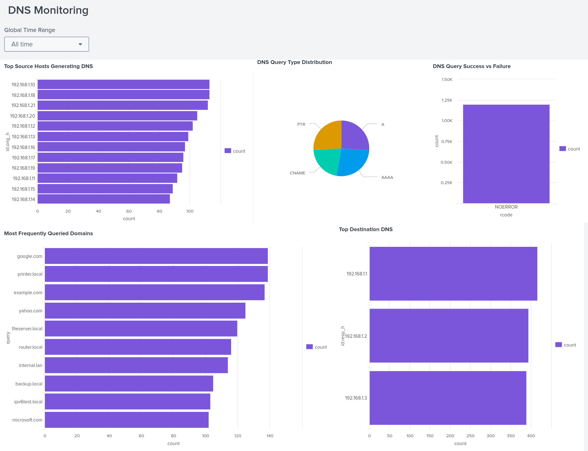

# Splunk-Dns-Log-Analysis
A hands-on project focused on ingesting, parsing, and analyzing DNS logs using Splunk.   This lab demonstrates how to extract useful insights from JSON-formatted Zeek DNS logs and visualize DNS activity for security monitoring.
 ## 🎯 Objective

In this lab, you will:

- Learn how to ingest and analyze DNS logs in Splunk  
- Understand how to extract information such as DNS query types, source hosts, and common destinations  
- Practice building SPL (Search Processing Language) queries  
- Detect anomalies such as failed lookups, suspicious domains, and high-latency behavior  

Dataset includes typical Zeek DNS fields:  
`ts`, `id.orig_h`, `id.resp_h`, `qtype`, `query`, `answers`, `rcode`, `rtt`.

---

## 🖥️ Lab Setup

### ✅ Requirements
- Splunk Enterprise or Splunk Free  
- JSON-formatted Zeek DNS logs  
- Browser access to Splunk Web  

### ✅ Dataset
Place the file `dns_logs.json` into a directory accessible to Splunk.

---

## 📥 Ingesting the DNS Logs

1. Go to **Splunk Web > Settings > Add Data**  
2. Select **Upload** → choose `dns_logs.json`  
3. Set:
   - **Source type:** `json`  
   - (Optional) Custom sourcetype → `zeek:dns`
   - **Index:** `dns_lab`  
4. Finish upload  
5. Confirm ingestion:

```spl
index=dns_lab | head 5
```

# 🔍 Lab Tasks

## ✅ **Task 1 — Identify the most frequently queried domains**

```spl
index=dns_lab sourcetype="json"
| stats count by query
| sort -count
```

## ✅ **Task 2 — Find the most active source IPs generating DNS traffic**
```spl
index=dns_lab sourcetype="json"
| stats count by id.orig_h
| sort -count
```

## ✅ **Task 3 — Breakdown of DNS query types (A, AAAA, CNAME, PTR, etc.)**
```spl
index=dns_lab sourcetype="json"
| stats count by qtype
```

## 🖼️ Dashboard Screenshot

Below is the Splunk DNS Monitoring Dashboard created for this project:



### 🔚 Conclusion
By completing this project, you have:

* Learned how to ingest and parse DNS logs into Splunk for analysis.
* Identified the most frequently queried domains and the top clients generating DNS traffic.
* Gained experience in analyzing different DNS record types (A, AAAA, CNAME, PTR).
* Detected anomalies such as failed resolutions, suspicious queries, and high-latency lookups.
* Built queries and dashboards to visualize DNS activity and configured alerts for unusual behavior.
